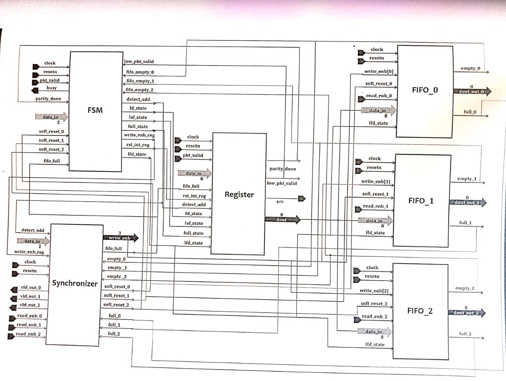

# Router Design - Verilog Implementation



## Key Features
- **3-channel FIFO** with soft reset capability
- **Packet-based routing** with header parsing
- **Parity checking** for error detection
- **Synchronized control** across multiple clock domains
- **Configurable** data width (default 8-bit)

## Module Specifications

### 1. router_fifo
- **Parameters**: 
  ```verilog
  parameter width=9, depth=16;
  ```
- **Ports**:
  - Inputs: clk, rstn, din[7:0], rd_enb, wr_enb, lfd_state, sft_rst
  - Outputs: d_out[7:0], full, empty

### 2. router_fsm
**State Machine Diagram**:
```
decode_address → wait_till_empty → load_first_data → load_data
      ↑               ↓                   ↑
      └──────[full]←[fifo_full]           |
                ↓                        |
          load_after_full → check_parity_error
```


## Installation
```bash
# Clone repository
git clone https://github.com/kathipallimadhukiran/router-design.git
cd router-design

# Run simulations (using Icarus Verilog)
make simulate
```

## Contributors
kathipalli madhu kiran - Initial design
